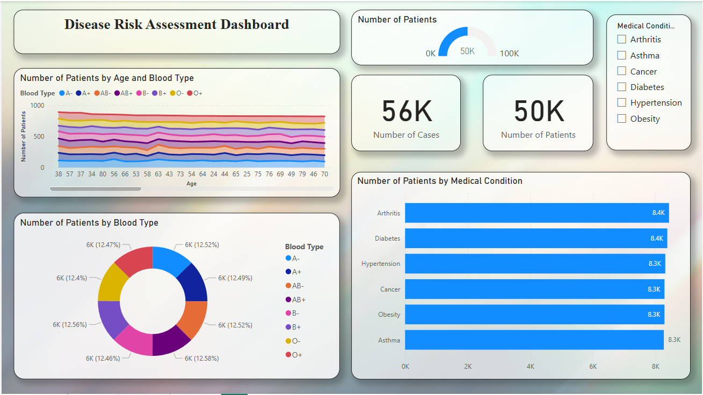
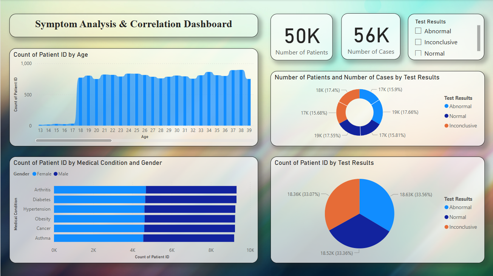
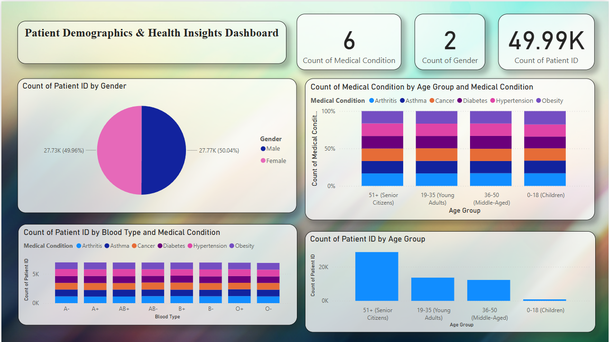

## **About the Dataset**

There are 55,500 patient hospitalization records in this dataset.
Includes 15 columns with information about each patient, his or her
name, age, gender, blood type and medical condition. Also, it gives the
hospitalization details like date of admission, doctor, hospital, room
number and admission type (urgent, emergency, elective, etc.). Among
other things, it also contains Billing Amount and Insurance Provider
financial data. Medication and Test results are recorded for patients’
treatments. It covers different hospitals, doctors and the medical
conditions among others and hence can be used to analyze the healthcare
trends, demographics of the patients and hospital bills.

## **Column Overview**

Personal Information: Name, Age, Gender, Blood Type

Medical Details: Medical Condition, Medication, Test Results

Hospital Details: Doctor, Hospital, Room Number, Admission Type

Billing & Insurance: Insurance Provider, Billing Amount

Timeline: Date of Admission, Discharge Date

## **Dashboard Overview**

In the first page of the dashboard,

It is showing the medical conditions of the patients, like how many of
them are having Arthritis, Asthma, Cancer, Diabetes, Hypertension and
Obesity along with the patient's blood type. You can view the page and
can select each of the medical condition from the Slicer in the top
right corner and by doing that you will see that for each and every
medical condition the dashboard is showing the records. Total number of
cases and Total number of patients are also shown by the cards. For
showing the different blood groups of how many of A-, A+, AB-, AB+, B-,
B+, O- and O+ are affected by the medical conditions are shown using the
stacked area chart clearly.

Figure 1: First page of the Dashboard

##

In the second page of the dashboard,

It is showing the Test results like how many of them are Abnormal,
Inconclusive and Normal. This page is also showing the number of
patients and the number of cases by test results, total count of the
patients in each of Abnormal, Inconclusive and Normal. Here it is
clearly seen that number of males and females are affected by the
medical conditions with their test results, like how many males and
females are affected by the medical conditions like Arthritis, Asthma,
Cancer, Diabetes, Hypertension and Obesity. Total count of Patient ID by
Age is also shown here for better understanding. A pie chart of Count of
patient ID by Test Results and donut chart of Number of Patients and
Number of cases by Test Results also being shown for the better
clarification in understanding about how many cases which are Abnormal,
Inconclusive and Normal.

Figure 2: Second page of the Dashboard

##

In the third page of the dashboard,

It is showing the male or female age division of the patients like
51+(Senior Citizens), 19-35 (Young Adults), 36-50(Middle Aged) and 0-18
(Children) are affected by the medical conditions like Arthritis,
Asthma, Cancer, Diabetes, Hypertension and Obesity. Here we can see all
the details by clicking on the male or female portions on the bar chart.
In this page of the dashboard, we can also see a good stacked column
chart between Count of Medical condition and Age group which clearly
adds details and make the understanding in a more clear manner. There is
also another stacked column chart of Count of Patient ID by Age Group at
the bottom right corner of the page which clearly tells how many of the
patients are Senior Citizens, Young Adults, Middle Aged and Children. In
the top right corner cards of Count of Medical Condition, Count of
Gender and Count of Patient ID are added for getting the total counts.

Figure 3: Third page of the Dashboard

## **Reference**

<https://www.kaggle.com/datasets/prasad22/healthcare-dataset/data>
